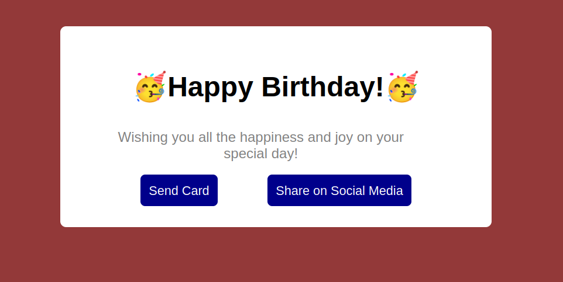

# 🎨 CSS Greeting Card with Pseudo-Classes and Pseudo-Elements

Welcome to this creative front-end project where I demonstrate my CSS skills by designing an interactive **Greeting Card** using pure HTML and CSS — no JavaScript required!

This project highlights my ability to use advanced **pseudo-classes** and **pseudo-elements** like `::before`, `::after`, `:hover`, `:nth-child()`, and more to create a fun, responsive, and stylish card.

---

## 💡 What You'll Find

- ✨ A fully designed greeting card layout
- 🎭 Interactive hover effects using `:hover` and `:active`
- 💌 Decorative elements crafted with `::before` and `::after`
- 📐 Responsive design principles
- 🎯 Clean, semantic HTML structure

---

## 🛠 Technologies Used

- HTML5
- CSS3 (with advanced pseudo-classes and pseudo-elements)

---

## 📸 Preview

  


---

## 🚀 Getting Started

Clone the repository and open `index.html` in your browser:

```bash
git clone https://github.com/karianjahi/greeting-card-css.git
cd greeting-card-css
open index.html  # or just double-click on the file
```

## 📚 Learning Objectives

This project was built to:

- Demonstrate visual creativity using HTML and CSS

- Explore advanced use of pseudo-elements and pseudo-classes

- Create UI effects without relying on JavaScript

- Strengthen understanding of modern CSS techniques

- Showcase personal front-end development skills

## File Structure
greeting-card-css/ <br>
├── index.html        # Main HTML structure <br>
├── styles.css        # All the CSS styling and effects<br>
├── preview.png       # Optional screenshot of the card<br>
└── README.md         # This file<br>


## Author
Dr.rer.nat Joseph Karianjahi Njeri<br>
Data Scientist @ Spiced GmbH, Berlin<br>
Frontend Enthusiast | CSS Explorer | Python Developer<br>
📍 Based in Karlsruhe, Germany<br>
📧 Contact: nkarianjahi@gmail.com<br>
🌐 [Linkedin Profile](www.linkedin.com/in/josephkarianjahinjeri)<br>


## 🌟 Show Your Support

If you enjoyed this project or found it useful, feel free to:

- ⭐ Star this repo

- 📬 Share it with others

- 🛠 Fork it and make your own version!


## 🪄 Bonus Challenge

Try tweaking the card to fit different occasions like:

- ❤️ Valentine's Day

- 🎄 Holiday greetings

- 👋 Farewell notes

Enjoy styling with CSS!


## 🧠 Behind the Scenes (Author Notes)

This greeting card project was designed as an exercise in using pseudo-elements and pseudo-classes. Key ideas that shaped the project:

- `skew()` was used for slanted hover effects

- `::before` and `::after` were used for decorative elements

- `border-radius` for a modern, smooth look

**These techniques demonstrate that compelling UI effects can be achieved with CSS alone, no JavaScript needed.**